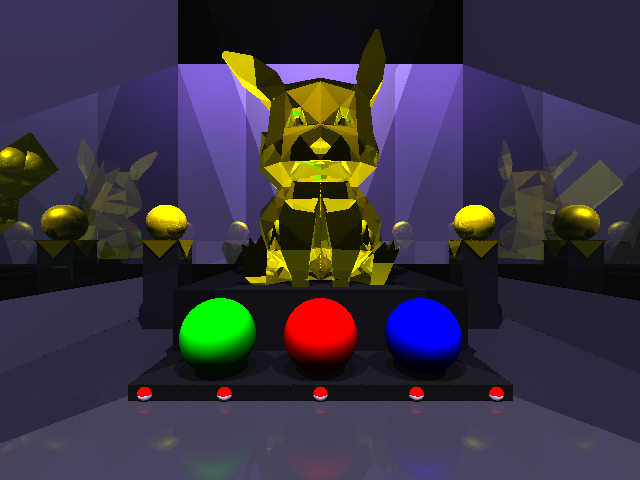

# EJs
En estos ejercicios realizados, se trabajó con el lenguaje de programación C. Se utilizó para gestionar variables y operadores aritméticos en cálculos básicos, y se emplearon estructuras de control para tomar decisiones y repetir tareas. Se implementaron operaciones de bits para manipular datos a nivel binario.

Se trabajó con arreglos y cadenas de caracteres para gestionar listas de datos y textos, así como con matrices para representar datos tabulares. Se utilizaron punteros para manejar memoria dinámica con malloc y free, y se crearon estructuras de datos como listas enlazadas.

Además, se modularizó el código en funciones y estructuras para mejorar la organización y reutilización. Se manipuló archivos de texto y binarios para almacenamiento persistente de datos.

# TP

Tiene como objetivo aplicar conocimientos sobre encapsulamiento en Tipos de Datos Abstractos (TDAs), punteros a funciones, tablas de búsqueda y técnicas de abstracción para simplificar problemas complejos. Estos temas amplían y complementan los conocimientos previos evaluados en ejercicios anteriores.

El resultado fue generar una escena con dimensiones y formatos a eleccion.

Esta escena cuenta con varios objetos, como esferas, planos,triangulos y objetos STL.

